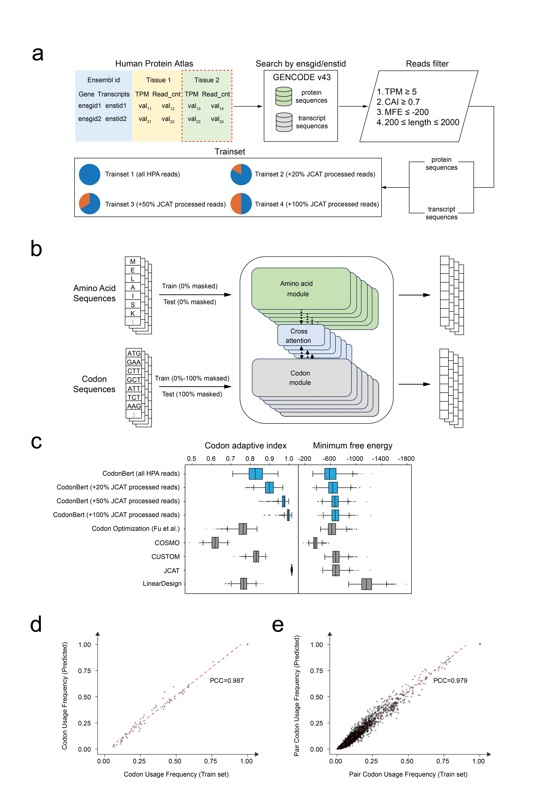

# Caution‼️ 

**Please note that the code in this repository is for personal use only. The original code has not been released under a license.**

# CodonBERT

**Please note that the code in this repository is for personal use only. The original code has not been released under a license.**

This is the code for the article [_CodonBert: a BERT-based architecture tailored for codon optimization using the cross-attention mechanism_](https://doi.org/10.1093/bioinformatics/btae330). CodonBERT is a flexible deep-learning model for codon optimization, which is inspired by ProteinBERT (Brandes et al., 2022). We made crucial modifications to build the CodonBERT. As for architecutre, (1) the right-side network was rebuilt to match the encoder on the left-side; (2) codon tokens are now used as both keys and values in the cross-attention mechanism, while the protein sequence serves as the query. In this way, CodonBERT learns codon usage preferences and contextual combination preferences via randomly masked codon tokens. 

CodonBERT requires amino acid sequences in FASTA format as input, and predicted the optimized codon sequences. Four trained models based on high-TPM data (with various proporations of JCAT-optimized sequences) are provided in this repository. The users can directly use `predict.py` to conduct codon optimization. Notably, we provided the `train.py` for developers to train a cusom model on specific data. Currently, hyperparameters for the `train.py` can only be modified in the source code. The source code itself is in `src/codonbert/config_function.py`. 




## Table of Contents

- [CodonBERT](#codonbert)
  - [Table of Contents](#table-of-contents)
  - [Installation](#installation)
    - [Dependencies](#dependencies)
  - [Usage](#usage)
    - [For users](#for-users)
    - [For developers](#for-developers)
  - [Citation](#citation)


## Installation

**Please note that the code in this repository is for personal use only. The original code has not been released under a license.**

We recommend `conda` to manage the computing environment. Here, the model training and prediction is based on Python and PyTorch. The calculation of CAI and MFE is based on EMBOSS v6.6.0 (Olson, 2002) and ViennaRNA v2.6.4 (Lorenz et al., 2011). The environment has been tested on an Ubuntu environment. 

In this repository (for personal use only), we provide a `pyproject.toml` file for the installation of the Python environment. The user can use the following commands to create a new environment and install the required packages.

```bash
## create a new environment
conda create -n codonbert python=3.10
conda activate codonbert
pip install build
python -m build
pip install .
```


## Usage
The code in this repository can be used for model training, prediction.

### Codon Optimization

For `predict.py`, the user only needs to ensure the paths of the `*.pt` file (model weights), the protein sequence file, and the output mRNA file. In this python package, you can instead use 

```bash
codon-opt -m $path_to_MODEL_WEIGHTS -i $path_to_Amino_Acid_FASTA -o $path_to_output
```

### For developers

CodonBERT is supposed to be trained easily and flexibly. Thus, developers only need to foucs on data collection. Developers can use and revise `train.py` to retrain a codon optimization model. Detailed architecture is stroed at `scripts/codon_bert_pytorch.py`. And the usual hyperparameters can be modified in `train.py`. Users can contact us directly for further help.

```bash
bert-train -t $path_trainset_fasta -v $path_validset_fasta -o $path_to_save_model_weights
```


### Data processing in our paper
1. tissue and TPM were screened
   -	Select a codon sequence in the script for a specific organization and the condition (TPM>5) that the TPM value meets

2. Length distribution statistics are performed and sequence filtering is performed according to length
   -	Based on the results of 01, codon sequences ranging in length from 200 to 2000 are screened

3. MFE and CAI indexes of codon sequences were calculated and counted
   - MFE and CAI calculations are saved into csv and scatter plots are drawn:

     -	Based on the results of 02 and the path of the environment, the CAI and MFE of the sequence are calculated and stored as a csv

     -	Scatterplot is drawn according to CAI and MFE values and stored in pdf format

   - Load the csv saved in the previous step and draw the edge histogram:

     - According to the results of 3.1, histograms are drawn in CAI and MFE directions, and the scatterplot together form the edge histogram

4. According to the calculation and statistical results of MFE and CAI indicators, the selection was carried out

   -	Based on the results of 03, the script selects codon sequences with CAI and MFE values that meet the conditions (CAI>0.7, MFE<-200)

5. The idea of JCAT was used to optimize the mRNA of the data set obtained in the previous step

   -	According to the results of 04, the codon sequence is converted to the amino acid sequence

   -	The amino acid sequence was optimized using Jcat method

6. The MFE and CAI statistics and screening of JCAT optimization results were carried out (To run the script: 03~04)

   -	According to the results of 2005, codon sequences matching (CAI>0.7, MFE<-200) in JCAT optimization results were screened

7. Build training sets and verification sets

   -	According to the results of 2006, the first 1w codon sequences are used to build the training set, and the remaining 973 sequences are used as verification sets in the model training process

   -	Four training sets were constructed according to different ratios of 1:0, 1:0.2, 1:0.5 and 1:1 between the screened real sequences and JCAT optimization results

```bash
python ./scripts/data_preocessing.py -t $path_transcript_rna_tissue_tsv_file -l $path_gencode_v43_pc_translations_fa_gz_file -c $path_gencode_v43_pc_transcripts_fa_gz_file -o $path_output
```


## Citation

Zilin Ren, Lili Jiang, Yaxin Di, Dufei Zhang, Jianli Gong, Jianting Gong, Qiwei Jiang, Zhiguo Fu, Pingping Sun, Bo Zhou, Ming Ni, CodonBERT: a BERT-based architecture tailored for codon optimization using the cross-attention mechanism, Bioinformatics, Volume 40, Issue 7, July 2024, btae330, https://doi.org/10.1093/bioinformatics/btae330

## Reference
Brandes,N. et al. (2022) ProteinBERT: a universal deep-learning model of protein sequence and function. Bioinformatics, 38, 2102–2110.

Lorenz,R. et al. (2011) ViennaRNA Package 2.0. Algorithms for Molecular Biology, 6, 26.

Olson,S.A. (2002) EMBOSS opens up sequence analysis. European Molecular Biology Open Software Suite. Brief Bioinform, 3, 87–91.
